# Invoice Processing Workflow

This flowchart shows the complete invoice processing workflow from file upload to export.

```mermaid
flowchart TD
    subgraph Setup["0. Folder Setup"]
        Z1[Select Folder Profile] --> Z2{Profile Exists?}
        Z2 -->|Yes| Z3[Apply Input/Output Folders]
        Z2 -->|No| Z4[Manage Folder Profiles]
        Z4 --> Z5[Create New Profile]
        Z5 --> Z3
    end

    subgraph Input["1. Input Phase"]
        Z3 --> A[Start]
        A --> B[Select Invoice File from Input Files List]
        B --> C{File Type?}
        C -->|CSV| D[Load CSV]
        C -->|XLSX| E[Load Excel]
        D --> F[Parse Data]
        E --> F
    end

    subgraph Mapping["2. Column Mapping Phase"]
        F --> G{Mapping Profile Exists?}
        G -->|Yes| H[Load Saved Profile]
        G -->|No| I[Create New Mapping]
        I --> J[Map Source Columns to Target Fields]
        J --> K[Save Profile]
        H --> L[Apply Mapping]
        K --> L
    end

    subgraph Configuration["3. Configuration Phase"]
        L --> M[Enter Invoice Total]
        M --> N[Select MID from Dropdown]
        N --> O[Set Processing Options]
        O --> O2[Configure Split Options]
    end

    subgraph Processing["4. Processing Phase"]
        O2 --> P[Click Process Invoice]
        P --> Q[Load Parts Master Data]
        Q --> R[Match Part Numbers]
        R --> S[Lookup HTS Codes]
        S --> T[Calculate Material Ratios]
        T --> U[Determine Section 232 Status]
        U --> V[Check Section 301 Exclusions]
        V --> W[Calculate Quantities]
        W --> X[Distribute Values]
    end

    subgraph Preview["5. Preview Phase"]
        X --> Y[Display Preview Table]
        Y --> Y2[Color-Code by Material Type]
        Y2 --> Z{Values Match Total?}
        Z -->|No| AA[Edit Values in Table]
        AA --> AB[Recalculate Total]
        AB --> Z
        Z -->|Yes| AC[Ready for Export]
    end

    subgraph Export["6. Export Phase"]
        AC --> AD[Click Export Worksheet]
        AD --> AE{Split by Invoice?}
        AE -->|Yes| AF[Generate Multiple Files]
        AE -->|No| AG[Generate Single File]
        AF --> AH[Save to Output Directory]
        AG --> AH
        AH --> AI[Move Source to Processed]
        AI --> AJ[End]
    end

    style A fill:#4CAF50,color:#fff
    style AJ fill:#4CAF50,color:#fff
    style Z fill:#FFC107,color:#000
    style AC fill:#2196F3,color:#fff
    style Z1 fill:#9C27B0,color:#fff
```

## Process Steps

### 0. Folder Setup (Folder Profiles)
- Select a Folder Profile from the dropdown on Invoice Processing tab
- Folder Profiles store input and output folder paths for different projects/clients
- Manage profiles via the gear button next to the dropdown
- Profiles are saved to the database and persist across sessions

### 1. Input Phase
- Input Files list shows all CSV/XLSX files in the configured Input folder
- User selects a file from the list or browses for a new file
- System parses the file and loads data into memory

### 2. Column Mapping Phase
- If a saved mapping profile exists for this invoice format, it's loaded automatically
- Otherwise, user creates a new mapping to match source columns to target fields
- Mappings can be saved for reuse with similar invoices

### 3. Configuration Phase
- User enters the commercial invoice total
- Selects the appropriate MID (Manufacturer ID) from the dropdown
- MID list is managed via Settings > General > MID List
- Sets any additional processing options (split by invoice, etc.)

### 4. Processing Phase
- System looks up each part number in the Parts Master database
- Retrieves HTS codes, material ratios, and country of origin data
- Calculates Section 232 tariff status based on material content
- Checks for Section 301 exclusions
- Calculates CBP quantities (Qty1, Qty2)
- Distributes values proportionally

### 5. Preview Phase
- Results displayed in editable preview table
- Color-coded rows indicate material classification:
  - Blue = Steel, Green = Aluminum, Orange = Copper, Brown = Wood, Purple = Automotive
- User can edit values directly in the table
- System validates that line values match invoice total

### 6. Export Phase
- Generate CBP-compliant Excel worksheet
- Option to split output by invoice number
- Source files moved to Processed folder
- Exported files appear in the Exported Files list
