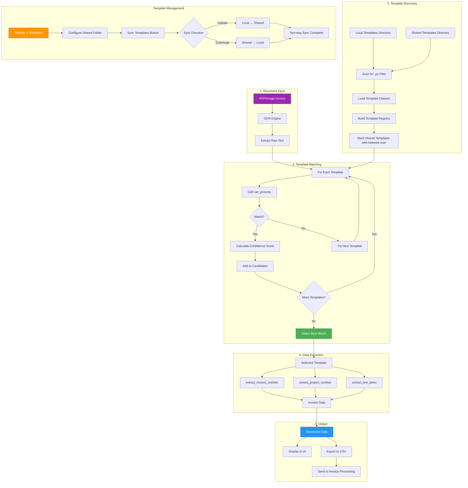

# PDF Processing Template System

This flowchart shows how the PDF Processing tab processes invoices using the template system.



## Template System Architecture

### Template Locations

**Local Templates** (editable):
```
Tariffmill/templates/
├── __init__.py          # Dynamic discovery logic
├── base_template.py     # Base class for all templates
├── sample_template.py   # Example template (excluded)
└── *.py                 # Custom templates
```

**Shared Templates** (read-only, network):
```
\\Network\Share\Templates\    # Configured in Settings > Templates
└── *.py                      # Shared templates (marked with network icon)
```

### Template Interface

Each template must implement:

```python
class MyTemplate(BaseTemplate):
    name = "Template Name"
    description = "Template description"
    client = "Client/Vendor name"
    version = "1.0.0"
    enabled = True

    def can_process(self, text: str) -> bool:
        """Check if this template can process the text"""
        pass

    def get_confidence_score(self, text: str) -> float:
        """Return 0.0-1.0 confidence score"""
        pass

    def extract_invoice_number(self, text: str) -> str:
        """Extract invoice number from text"""
        pass

    def extract_line_items(self, text: str) -> List[Dict]:
        """Extract line items from text"""
        pass
```

## Matching Algorithm

1. **Load All Templates** - Scan local and shared directories for Python files
2. **Filter Enabled** - Only consider templates with `enabled = True`
3. **Test Each Template** - Call `can_process()` on extracted text
4. **Score Matches** - Calculate confidence scores for matching templates
5. **Select Best** - Choose template with highest confidence score

## Template Sharing

### Shared Templates Configuration

Configure shared templates via **Settings > Templates**:

1. **Shared Folder** - Set a network path for shared templates
2. **Save & Refresh** - Save the path and reload templates
3. **Sync Templates** - Two-way sync between local and shared folders

### Sync Behavior

The **Sync Templates** button performs bidirectional synchronization:

- **Upload**: Copies newer local templates to the shared folder
- **Download**: Copies newer shared templates to local folder
- **New templates**: Copied in both directions
- Uses file modification timestamps to determine which version is newer

### Working with Shared Templates

- Shared templates appear with a **network indicator** in the template dropdown
- Shared templates are **read-only** - you cannot edit them directly
- To modify a shared template: Right-click > **Copy to Local**
- Edit the local copy, then sync back to shared

## Hot Reload

Templates support hot reload:
- Click **Refresh** button to rescan directories
- New templates are automatically discovered
- Modified templates are reloaded
- Deleted templates are removed from registry
