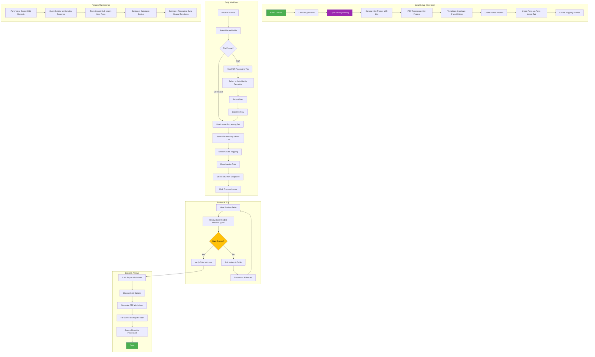
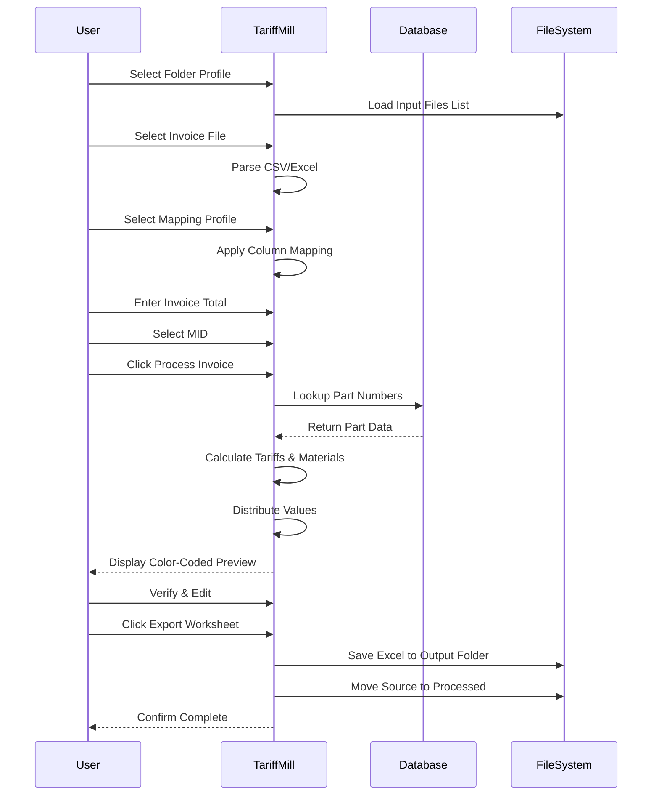

# User Workflow

This flowchart shows the end-to-end user journey for processing customs documentation.

## Detailed User Steps

### Initial Setup

1. **Install Application**
   - Run TariffMill_Setup.exe installer
   - Or use standalone TariffMill.exe

2. **Configure Settings** (Settings > Settings)
   - **General**: Choose theme (Light/Dark), configure MID list
   - **PDF Processing**: Set default input/output folders
   - **AI Provider**: Enter API key for AI-powered features
   - **Templates**: Configure shared templates network folder
   - **Database**: View database location, configure backups
   - **Updates**: Enable/disable automatic update checks

3. **Create Folder Profiles**
   - Invoice Processing tab → Folder Profile dropdown → Manage (gear icon)
   - Create profiles for different clients/projects
   - Each profile stores input and output folder paths

4. **Import Parts Data**
   - Parts Import tab (dedicated import interface)
   - Load CSV file → Preview data → Map columns
   - Select import mode (Insert/Update/Upsert)
   - Click Import Parts

5. **Create Mapping Profiles**
   - Process first invoice from each supplier
   - Create mapping for that invoice format
   - Save profile for future use

### Daily Invoice Processing

### Quick Reference

| Task | Location | Steps |
|------|----------|-------|
| Process CSV/Excel Invoice | Invoice Processing tab | Select Folder Profile → Select File → Map → Process → Export |
| Process PDF Invoice | PDF Processing tab | Drop PDF → Select Template → Extract → Send to Invoice Processing |
| Manage Folder Profiles | Invoice Processing tab | Click gear icon next to Folder Profile dropdown |
| Add New Part | Parts View tab | Right-click → Add Row |
| Edit Part | Parts View tab | Double-click cell |
| Search Parts | Parts View tab | Use search box or Query Builder button |
| Import Parts (Bulk) | Parts Import tab | Load CSV → Map Columns → Import |
| Configure MID List | Settings > Settings > General | Edit MID List section |
| Change Theme | Settings > Settings > General | Select Light/Dark/System |
| Configure Shared Templates | Settings > Settings > Templates | Set shared folder, click Sync |
| Backup Database | Settings > Settings > Database | Click Backup Now |
| View Logs | Log View menu | View Log |

### Keyboard Shortcuts

| Shortcut | Action |
|----------|--------|
| Ctrl+O | Open invoice file |
| Ctrl+S | Save/Export |
| Ctrl+P | Process invoice |
| Ctrl+F | Search parts |
| Ctrl+R | Refresh/Reprocess |
| F5 | Refresh file lists |

### Troubleshooting Common Issues

| Issue | Solution |
|-------|----------|
| Part not found | Add via Parts View or import via Parts Import tab |
| Values don't match | Edit directly in preview table |
| Wrong HTS code | Update in Parts View tab |
| Missing MID | Add to MID list in Settings > General |
| Export fails | Check output folder permissions |
| Shared templates not showing | Check Settings > Templates folder path |
| Folder profile not applying | Click Sync or reselect the profile |
